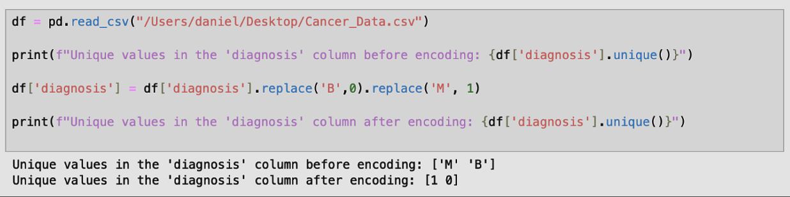
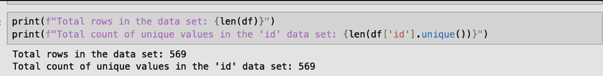
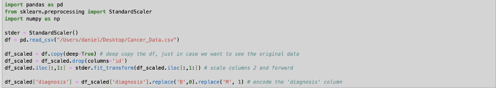
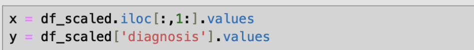
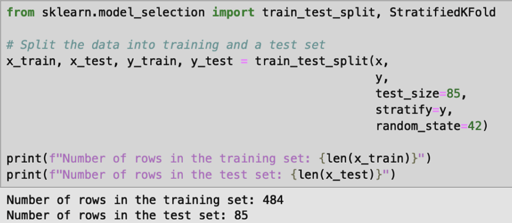
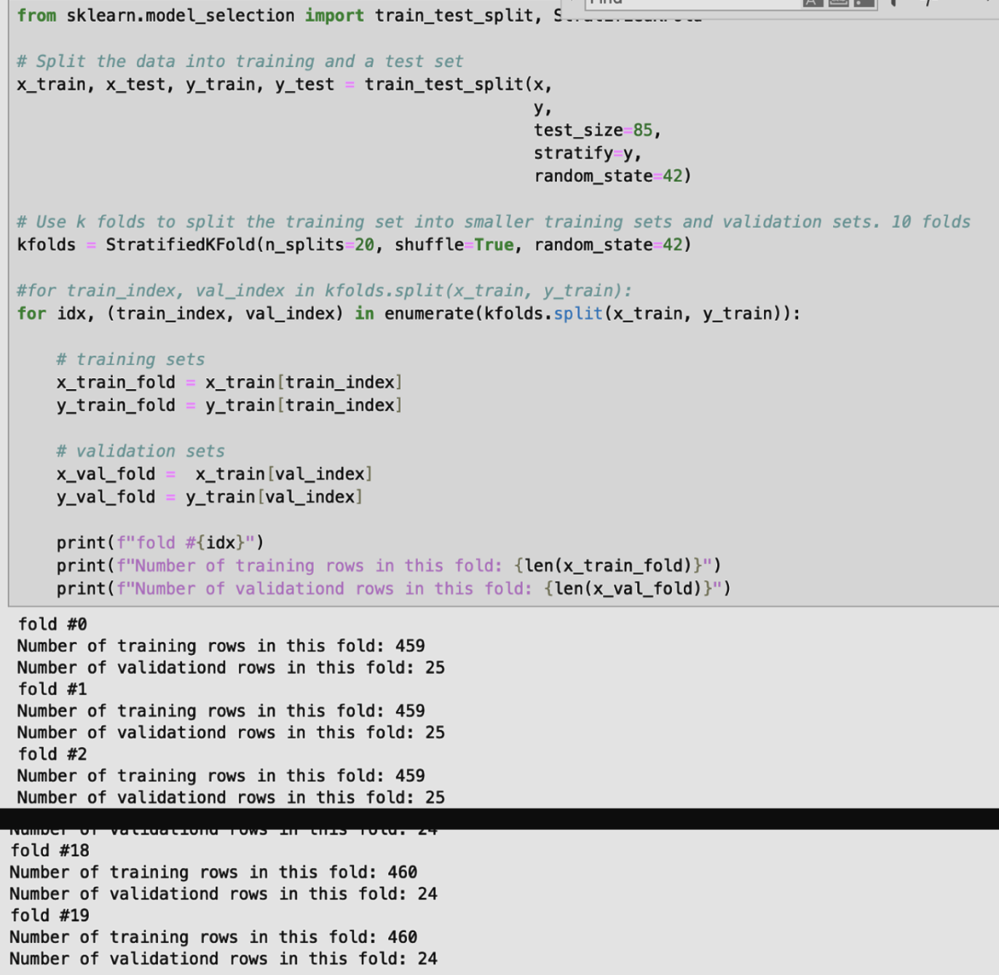
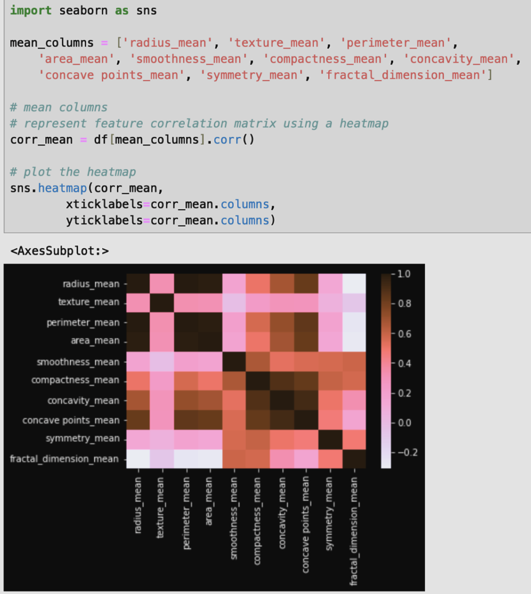

# Business Proposal
The business objective of this project is to help us predict a cancer diagnosis, specifically using breast cancer data. With a problem that affects us all so closely as humans, the benefit of this project is a direct improvement on our livelihoods. My model will aim to predict whether a
cancer is malignant vs benign, and will it be possible to reduce the false negative rate? The data used for this project can be found here: https://www.kaggle.com/datasets/erdemtaha/cancer-data
With a reliable prediction, this model can improve diagnosing patients so they can make informed decisions on their health.

#### Assumptions about the data
- The classification of malignant vs benign is accurate and not misdiagnosed
- The traits being observed are related to the cell nuclei of patients with breast cancer
- The features that end with “_mean” are the mean of all the cells observed for that trait
- Features that end with “_se” are the standard error, which is in respect to the mean
- Features that end with “_worst” is the maximum value of those values observed
- I assume the units are in micrometers, since we are looking at human cells.
- With respect to false diagnoses, it will be better to assume patients have cancer than not, since that will be less deadly in the long term; obviously reducing any false diagnoses overall will be a priority if possible. Striking a healthy balance between these will be necessary to improve my accuracy.
- I confirmed none of the features have any missing values nor empty strings. The features about concavity do have values of 0, but it is intentional as it indicates the cell has no concave characteristics.
- I confirmed no extra parameters nor data is needed, as this dataset is robust on its own with 569 rows and 33 columns. Additionally, due to the extremely unique nature of this dataset, I could not find supplementary data that could be joined.

#### Similar Projects
Historically, yes there are things like this being done without Machine Learning but on a case by case basis. Because breast cancer has such a long history, many tools are used to help diagnose it like diffusion weighted imaging or spectroscopy. As seen in this link: https://pmc.ncbi.nlm.nih.gov/articles/PMC8156889/
To study this in large amounts like how Machine Learning does, however, requires a tool with a large database. A product like Ancestry or 23andMe that gathers genetic information recognizes multiple factors that can determine how likely one is to have breast cancer without having to rely on machine learning.
https://www.23andme.com/

#### Data Dictionary
| field                   | type  | description                                                                                                                             |
|-------------------------|-------|-----------------------------------------------------------------------------------------------------------------------------------------|
| id                      | int   | unique identifier for each patient                                                                                                      |
| diagnosis               | str   | Type of Cancer: "M" for Malignant or "B" for Benign                                                                                     |
| radius_mean             | float | Mean of distances from the cells' nucleus to points on their perimeter. Measured in micrometers (µm).                                   |
| texture_mean            | float | Mean of the standard deviation of gray-scale values. Measured in micrometers (µm).                                                      |
| perimeter_mean          | float | Mean of cells' perimeter. Measured in micrometers (µm).                                                                                 |
| area_mean               | float | Mean of cells' area. Measured in micrometers (µm).                                                                                      |
| smoothness_mean         | float | Mean of the local variation in the cells' radius lengths. Measured in micrometers (µm).                                                 |
| compactness_mean        | float | Mean of the (perimeter^2 / area - 1.0)                                                                                                  |
| concavity_mean          | float | Mean of severity of the cells' concave portions of the contour. Measured in micrometers (µm).                                           |
| concave points_mean     | float | Mean of the number of cells' concave portions of the contour. Measured in micrometers (µm).                                             |
| symmetry_mean           | float | Mean of the cells' symmetry. Measured in micrometers (µm).                                                                              |
| fractal_dimension_mean  | float | Mean of the cells' (coastline approximation - 1). Measured in micrometers (µm).                                                         |
| radius_se               | float | Standard error of distances from the cells' nucleus to points on their perimeter, in respect to the mean. Measured in micrometers (µm). |
| texture_se              | float | Standard error of the standard deviation of gray-scale values, in respect to the mean. Measured in micrometers (µm).                    |
| perimeter_se            | float | Standard error of cells' perimeter, in respect to the mean. Measured in micrometers (µm).                                               |
| area_se                 | float | Standard error of cells' area, in respect to the mean. Measured in micrometers (µm).                                                    |

#### Preprocessing
My initial transformation will be to encode the diagnosis column, such that Malignant = 1 and Benign = 0. Since there are only two unique values here, this will be easy to encode without having to use the OrdinalEncoder library.

  * id: Drop this column because it is a 1-1 mapping to each row. This 100% correlation will not contribute to training the model.
    
  * diagnosis: Omit this column from the scaler because it is a classification column

I intend to use the Scaler library on the data except on ‘id’ and ‘diagnosis’.

I will separate my data for the columns with the measurements and a classification column. ‘x’ for the measurements, and ‘y’ for the classification.

I then will use stratified K folds. Given my dataset has 569 rows, I will be more conservative with the amount of data separated for the test and validation sets. Instead of the typical 80/20 split, I will do an 85/15 split.

   * Training Set: 85% (484 rows)
   * Test Set: 15% (85 rows)

I will then use 20 folds using the stratified K folds to further split my training data into smaller training sets and validation sets to use for hyperparameter tuning later on.

Visualization of Data:
First, I decided to visualize the mean, standard error, and worst columns separately. We can generally see the strongest correlations (negative included) are between the circle’s sizing (radius, perimeter, area) vs the circle’s shape (fractal_dimension, symmetry, concave points_mean). These relationships may offer insight into which columns can train the model better.

