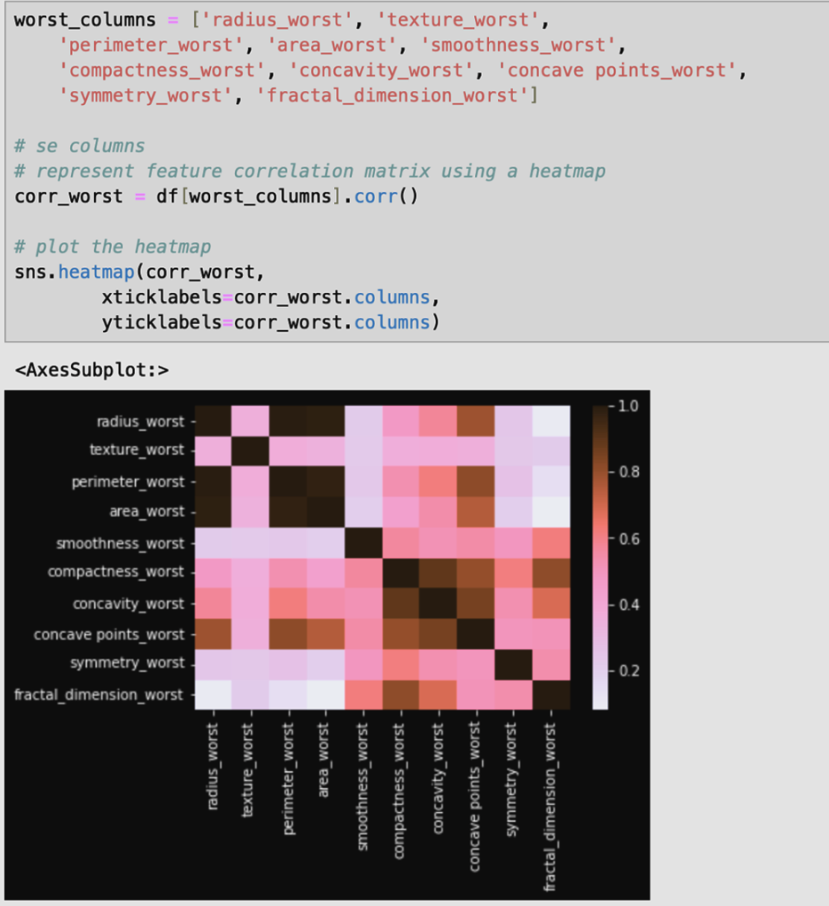
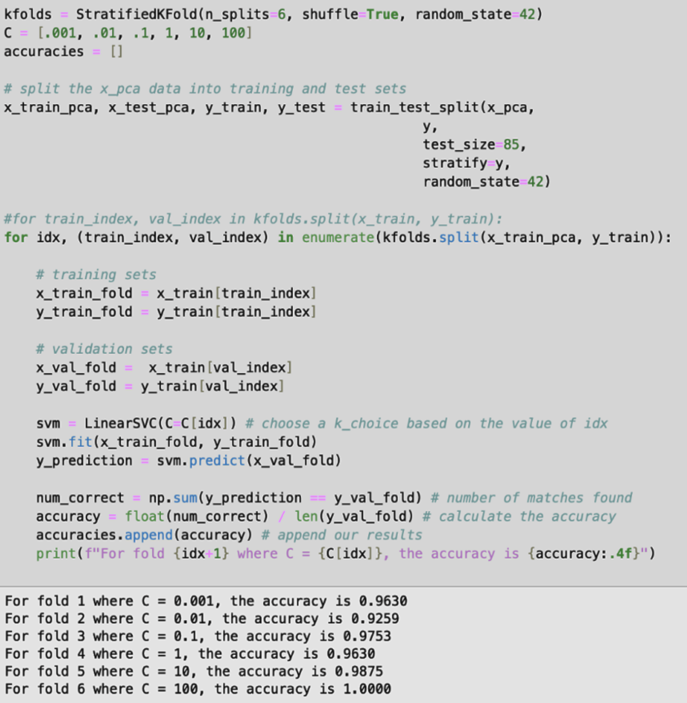

# Business Proposal
The business objective of this project is to help us predict a cancer diagnosis, specifically using breast cancer data. With a problem that affects us all so closely as humans, the benefit of this project is a direct improvement on our livelihoods. My model will aim to predict whether a
cancer is malignant vs benign, and will it be possible to reduce the false negative rate? The data used for this project can be found here: https://www.kaggle.com/datasets/erdemtaha/cancer-data
With a reliable prediction, this model can improve diagnosing patients so they can make informed decisions on their health.

#### Assumptions about the data
- The classification of malignant vs benign is accurate and not misdiagnosed
- The traits being observed are related to the cell nuclei of patients with breast cancer
- The features that end with “_mean” are the mean of all the cells observed for that trait
- Features that end with “_se” are the standard error, which is in respect to the mean
- Features that end with “_worst” is the maximum value of those values observed
- I assume the units are in micrometers, since we are looking at human cells.
- With respect to false diagnoses, it will be better to assume patients have cancer than not, since that will be less deadly in the long term; obviously reducing any false diagnoses overall will be a priority if possible. Striking a healthy balance between these will be necessary to improve my accuracy.
- I confirmed none of the features have any missing values nor empty strings. The features about concavity do have values of 0, but it is intentional as it indicates the cell has no concave characteristics.
- I confirmed no extra parameters nor data is needed, as this dataset is robust on its own with 569 rows and 33 columns. Additionally, due to the extremely unique nature of this dataset, I could not find supplementary data that could be joined.

#### Similar Projects
Historically, yes there are things like this being done without Machine Learning but on a case by case basis. Because breast cancer has such a long history, many tools are used to help diagnose it like diffusion weighted imaging or spectroscopy. As seen in this link: https://pmc.ncbi.nlm.nih.gov/articles/PMC8156889/
To study this in large amounts like how Machine Learning does, however, requires a tool with a large database. A product like Ancestry or 23andMe that gathers genetic information recognizes multiple factors that can determine how likely one is to have breast cancer without having to rely on machine learning.
https://www.23andme.com/

# Exploratory Data Analysis

#### Data Dictionary
| field                   | type  | description                                                                                                                             |
|-------------------------|-------|-----------------------------------------------------------------------------------------------------------------------------------------|
| id                      | int   | unique identifier for each patient                                                                                                      |
| diagnosis               | str   | Type of Cancer: "M" for Malignant or "B" for Benign                                                                                     |
| radius_mean             | float | Mean of distances from the cells' nucleus to points on their perimeter. Measured in micrometers (µm).                                   |
| texture_mean            | float | Mean of the standard deviation of gray-scale values. Measured in micrometers (µm).                                                      |
| perimeter_mean          | float | Mean of cells' perimeter. Measured in micrometers (µm).                                                                                 |
| area_mean               | float | Mean of cells' area. Measured in micrometers (µm).                                                                                      |
| smoothness_mean         | float | Mean of the local variation in the cells' radius lengths. Measured in micrometers (µm).                                                 |
| compactness_mean        | float | Mean of the (perimeter^2 / area - 1.0)                                                                                                  |
| concavity_mean          | float | Mean of severity of the cells' concave portions of the contour. Measured in micrometers (µm).                                           |
| concave points_mean     | float | Mean of the number of cells' concave portions of the contour. Measured in micrometers (µm).                                             |
| symmetry_mean           | float | Mean of the cells' symmetry. Measured in micrometers (µm).                                                                              |
| fractal_dimension_mean  | float | Mean of the cells' (coastline approximation - 1). Measured in micrometers (µm).                                                         |
| radius_se               | float | Standard error of distances from the cells' nucleus to points on their perimeter, in respect to the mean. Measured in micrometers (µm). |
| texture_se              | float | Standard error of the standard deviation of gray-scale values, in respect to the mean. Measured in micrometers (µm).                    |
| perimeter_se            | float | Standard error of cells' perimeter, in respect to the mean. Measured in micrometers (µm).                                               |
| area_se                 | float | Standard error of cells' area, in respect to the mean. Measured in micrometers (µm).                                                    |

#### Preprocessing
My initial transformation will be to encode the diagnosis column, such that Malignant = 1 and Benign = 0. Since there are only two unique values here, this will be easy to encode without having to use the OrdinalEncoder library.

  * id: Drop this column because it is a 1-1 mapping to each row. This 100% correlation will not contribute to training the model.
    
  * diagnosis: Omit this column from the scaler because it is a classification column

I intend to use the Scaler library on the data except on ‘id’ and ‘diagnosis’.

I will separate my data for the columns with the measurements and a classification column. ‘x’ for the measurements, and ‘y’ for the classification.

I then will use stratified K folds. Given my dataset has 569 rows, I will be more conservative with the amount of data separated for the test and validation sets. Instead of the typical 80/20 split, I will do an 85/15 split.

   * Training Set: 85% (484 rows)
   * Test Set: 15% (85 rows)

I will then use 20 folds using the stratified K folds to further split my training data into smaller training sets and validation sets to use for hyperparameter tuning later on.

Visualization of Data:
First, I decided to visualize the mean, standard error, and worst columns separately. We can generally see the strongest correlations (negative included) are between the circle’s sizing (radius, perimeter, area) vs the circle’s shape (fractal_dimension, symmetry, concave points_mean). These relationships may offer insight into which columns can train the model better.

Seeing these relationships, I took a mixture of columns related to the size vs shape of the cell’s circle and created a heatmap out of those. Below, you can generally see the same correlations persist even across the (‘mean’ vs ‘standard error’) or’ (‘standard error’ vs ‘worst columns’).

To provide emphasis on the correlations, I also created some scatter plots to better visualize the data. While there is a clear relationship between variables related to the size of the circle, we can also see clustering in the other plots. For example, we can see a cluster in the (‘perimeter_mean’ vs ‘symmetry_mean’). Because malignant tumors are abnormal in themselves, my intuition tells me that any points that fall outside of the cluster are indicative of a malignant diagnosis.

I also plotted histograms for each field, and I can see all of the measurement columns follow a normal distribution or logarithmic distribution. Knowing every value is populated will offer reliability in the training models. Most evidently, there are no outliers visible in this data.

# Model Training
My three models include K-Nearest Neighbors (KNN), K Means, and Support Vector Machine (SVM).

##### Model 1: KNN
For my KNN model, the business objective is to capture our false positive rate and to see if we can improve it with Linear Discriminant Analysis (LDA). Because we have strong clustering evident in the scatterplots, KNN is an intuitive choice as my first model to train. To test multiple k values, I used the K-folds technique.

My results yielded accuracy results consistently >.90, but the best ones were k=10, 12, 20, and 50 at 97.92%. Normally this is a good score, but let's see if I can bring that up to 99% with dimensionality reduction. Since KNN is a supervised training model, hopefully LDA can improve the classification results through its ability to emphasize clustering. Again I use K folds here.

Our results show 1, 12, and 20 as 100%. These are likely overfitted models, so I will avoid these. However, k=10 has 97.92% in both the non-LDA and LDA models and is the highest accuracy recorded outside of the overfitted models. I will move forward with k=10.

Below I will calculate the accuracy, confusion matrix, and ROC curve results on one fold without using LDA data to avoid overfitting.

Our results show the Area Under the Curve (AUC) is .9722.
From my results from one fold, I can see the non-LDA data has an accuracy of 97.92.% where k=10. The non-LDA model even has no false negatives. My ROC curve is favorable with an "Area Under the Curve" (AUC) > .9, proving that KNN is a good classifier.

However in healthcare, any misdiagnosed cases can be deadly. 97.92% accuracy is good, but let's see if I can improve the accuracy in the following models.

##### Model 2: K Means

The business objective here is to successfully cluster my data and prove the binary classifications can be separated by their features. Given the data has 30 features, I will use Principal Component Analysis (PCA) to shape the data into 2D. I can then use that plane to visualize the data and the feature separation. Afterwards, I would like to use KMeans to see how well the model clusters when using PCA data. Below is our clustering when using PCA on the data.

From my plot we can see the Benign cases (green circles) are more densely clustered and generally have an value < 5. Malignant cases (red x) are not as densely clustered, and also exhibit more variance. There is still a lot of overlap between the two classifiers however.

Having done PCA on our data, lets see if KMeans is able to properly cluster the data. Since I have a binary classifier, I know the number of my clusters will be 2. n_clusters=2

In the plot above, I can see that the clustering after using K Means seems pretty well defined. The blue x’s are centroids, and one can see a clear boundary line between the two clusters. This indicates to me the feature space can be separated for malignant vs benign cases.

##### Model 3: Support Vector Machines
Having seen our features can be clustered definitively in our PCA -> KMeans model, let's use Support Vector Machine to see if we can draw a boundary between the two classes. The objective here will be to train the best model we can knowing we have good clustering. I will use the Linear SVC model on the same PCA data from our KMeans model, since we know it shows better clustering. Again I will use the K folds technique, but for only 6 folds this time. The hyperparameter I will be testing is C, and I will be testing different multiples of ten.

I can see from my accuracy results in the k folds that 10 may have the best fit. C=100 is likely overfitted at 100%. Using C=10 on one fold, I will plot the confusion matrix and calculate the ROC.

I can see above that the ROC curve is with an AUC=.9900. The model also has a 98.75% accuracy and no false negatives. A slightly better model compared to our KNN model at 97.92% accuracy. These measurements indicate that SVM is a better classifier than KNN. Despite the one false negative, SVM looks to be the best model to use for this data.

# Further Model Training

Next, I will expand on my Support Vector Machine (SVM) model and boost it with a K Means model. To begin, I only tested the C hyperparameter for my SVM model after the data was dimensionally reduced with Principal Component Analysis (PCA). I would like to see how well it performs using the additional "penalty" hyperparameter. 

I will use the data that has been dimensionally reduced by PCA, "x_train_pca", and compare the accuracies with different "C" and "penalty" values. The hyperparameters will be tested with K folds.

My results yielded varying accuracies for each hyperparameter tuning, so I plotted them for a better visualization.

From my plot, I can see the accuracies generally performed better when penalty = "l2" over 6 different C values, so I will use "l2" for penalty. For C, I can see C=100 is 100% which means it's likely overfitted. Rather, I will use C=10 where both "l1" and "l2" showed 98.75% accuracy.

Next, I will boost the SVC model with results from my K Means model. In my KMeans model, I will measure the distance to the centroids for each point, and add it as a feature to my dataset before using SVM. This can hopefully improve my results.

My data shape before boosting was 569 rows and two columns. After boosting it with results from my K Means model, it came out to 569 rows and four columns. With my new training data boosted, I fit the SVC model using penalty="l2" and C=10. I will then perform a prediction on the test data.

My accuracy came out to 98.82%. A desirable score for predicting benign vs malignant cases. 

To further validate my results, I calculated the ROC and AUC. With an AUC of .9844, I know my model is reliable.

For future development, more data samples from a variety of sources would be helpful. The models yielded high accuracy, but the robustness against other data sets is yet to be determined. On a more technical note, this model could benefit from a bagging technique with three different models. Because only two of my models yielded binary classification results, I opted for a boosting technique instead. This proved successful with a 98.82 accuracy and no false negatives.

# Conclusion

My objective with this analysis was to create a reliable model to predict whether a case of breast cancer is benign or malignant. I also wanted to reduce the false negative rate due to how dangerous it would be to be declared cancer-free but still be malignant. My variables in the dataset are measurements about the mean, standard error, and worst values of characteristics of these cancer cells, as well as the classifier of benign vs malignant. After data normalization, I used three models to study the data:

* K Nearest Neighbors (KNN)
* K Means
* Support Vector Machines (SVM)

My goal with KNN was to see how well I could classify the data right away and use this weak predictor to tune my Linear Discriminant Analysis (LDA). By performing K folds on KNN ten times without LDA and ten times with LDA, I was able to discern that LDA data was not a good option due to a lot of overfitting. Without using LDA I was able to achieve a 97.92% accuracy using K=10 and an AUC score of .9722. A good score overall on a validation fold, but let’s see if we can improve on this.

In my K Means model, my goal was to see if the features in the data can be separated. If the clustering of the data is strong enough, a model may be able to classify better on that data. In order to plot my data successfully, I used Principal Component Analysis (PCA) to transform the data to a 2D array and put emphasis on the clustering. The boundaries were not well drawn with a PCA transformation, but after using K Means on top of PCA the clustering came out with a definitive boundary line. This proved my binary classifier could be separated in a feature space.

In my third model, SVM, I tested how well clustering could occur with a linear boundary line. By using K folds to tune the hyperparameter, C, I was able to yield a 98.75% accuracy with an AUC of .99. These are good results, but this is only on training data on a fold. Seeing that K Means showed a boundary line and SVM proved to be a reliable predictor, I wanted to see if I can get a model that performs well with ensemble learning.

To improve my SVM model, I boosted the data with results from my K Means model. By taking the distance to the clusters’ centroids as a feature, I appended that data to use for training in my SVM model. After fitting and predicting on the test data, I yielded 98.82% accuracy with an AUC score of .9844 and no false negatives. 

In conclusion, my model successfully predicts whether a case of breast cancer is benign vs malignant when using the data with PCA, K Means, and then SVM. The model predicts at 99% rounded and has no false negatives, meeting my objective.
